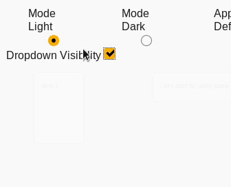

import {useState} from 'react'
import { Props, Playground } from 'docz'
import Dropdown from './src/lib'

## Introduction

Dropdown Component is a react component that creates a dropdown menu using many of material design guide styles.

## Installation

You can install it using `yarn`:

    yarn add @redwallsolutions/dropdown-component-module

Or using `npm`:

    npm i @redwallsolutions/dropdown-component-module

## Props

<Props of={Dropdown} />

## Usage

Dropdown Component is very easy to use:

<Playground>
    {
        () => {
            const [visible, setVisible] = useState(true)
            return (
                
    
                    <label htmlFor="visibility">Dropdown Visibility</label>
                    <input
                        type="checkbox"
                        onChange={() => {
                            setVisible(!visible)
                        }}
                        checked={visible}
                        style={{ marginBottom: '50px' }}
                    />
                    <Dropdown
                        visible={visible}
                        items={[
                            { text: 'Awesome Option' },
                            { text: 'Second Thing' },
                            { text: 'I ❤️ Redwall' }
                        ]}
                    />
	            

            )
        }
    }
</Playground>

### Dark Mode

It supports dark mode by passing the `mode` attribute from `theme` object. Take a look:

<Playground>
    

        <Dropdown
            theme={{ mode: 'dark' }}
            visible={true}
            items={[
                { text: 'Another Option' },
                { text: "I'm a nice option" },
                { text: 'VERY LOOOOOOOOOOOOOOOOOOOOOOOOOOOOOOOOOOOONG' }
            ]}
        />
    

</Playground>

### Origin

Dropdown also supports a `origin` prop. It's a representation of the `transform-origin` css prop.

In this example, we passed a **center** as origin prop value.

<Playground>
    {
        () => {
            const [visible, setVisible] = useState(true)
            return (
                
    
                    <label htmlFor="visibility">Dropdown Visibility</label>
                    <input
                        type="checkbox"
                        onChange={() => {
                            setVisible(!visible)
                        }}
                        checked={visible}
                        style={{ marginBottom: '50px' }}
                    />
                    <Dropdown
                        visible={visible}
                        items={[
                            { text: 'Awesome Option' },
                            { text: 'Second Thing' },
                            { text: 'I ❤️ Redwall' }
                        ]}
                        origin="center"
                    />
	            

            )
        }
    }
</Playground>